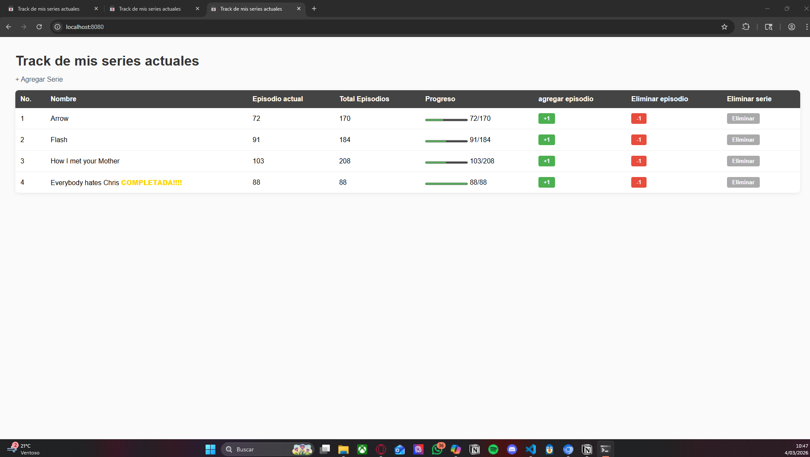
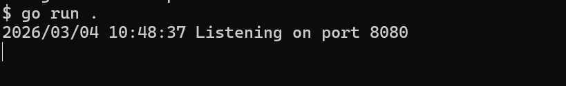

Servidor HTTP construido desde cero en Go (sin frameworks) que permite llevar un registro de series de televisión, con persistencia en SQLite.
¿Como correr el proyecto?:
"go run ."

Luego abrir el navegador en http://localhost:8080.

challenges implementados :
Ver todas las series en una tabla dinámica generada desde la base de datos
Agregar nuevas series con nombre, episodio actual y total de episodios
Incrementar o decrementar el episodio actual con botones +1 y -1
Eliminar series de la base de datos
Barra de progreso visual por serie
Indicador especial para series completadas
Estilos y css
código de go esté propiamente ordenado en archivos 
código de javascript esté ordenado en archivos	
Por agregar un favicon

Estructura general del lab:

├── main.go                 # Punto de entrada, conexión a DB y servidor TCP
├── handler.go              # Router principal — maneja method y path
├── handleIndex.go          # GET / — tabla de series
├── handleCreate.go         # GET /create — formulario para agregar serie
├── handleCreatePost.go     # POST /create — inserta serie en DB y redirige
├── handleUpdate.go         # POST /update?id=X — incrementa episodio
├── handleRestdate.go       # POST /downdate?id=X — decrementa episodio
├── handleDelete.go         # DELETE /delete?id=X — elimina serie
├── handleFavicon.go        # GET /faviconm.png — sirve el favicon
├── handleScript.go         # GET /script.js — sirve el archivo JavaScript
├── script.js               # Lógica JavaScript (nextEpisode, prevEpisode, deleteSerie)
├── faviconm.png            # Favicon del sitio
├── series.db               # Base de datos SQLite
├── go.mod                  # Dependencias del módulo Go
├── go.sum                  # Checksums de dependencias
└── README.md               # Documentación del proyecto

Screenshot de mi servidor corriendo

y la terminal 

